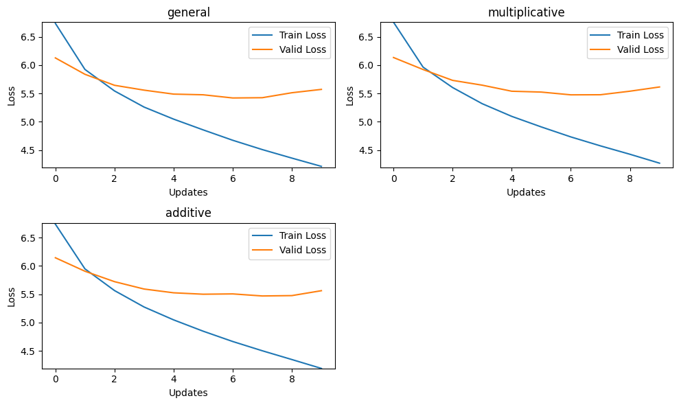
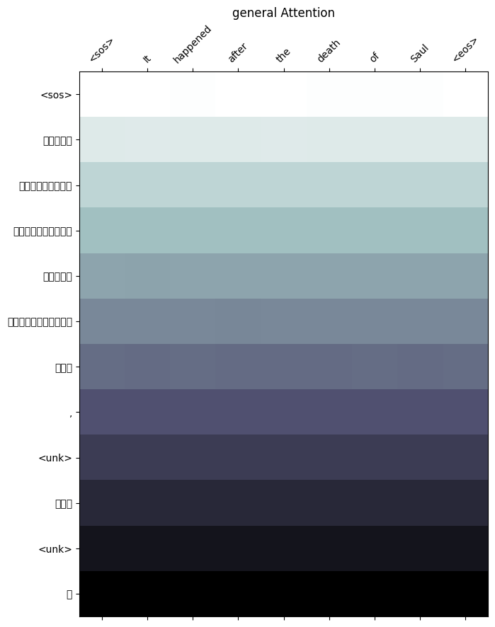
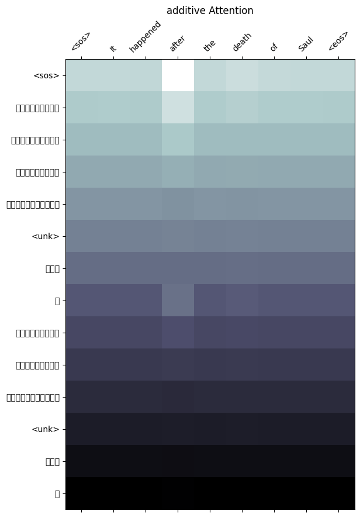
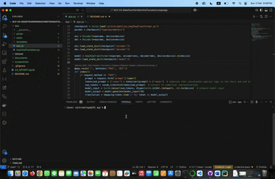

# NLP-A3-MakeYourOwnMachineTransationLangiuage
Language Translation
This repository contains the implementation of a web application for English to Nepali translation in natural language processing.
Instead of using the default dictionary this repository contains the implementation of dataset from Hugginface which contains translation of Holy Bible translation.

Due to limitations of resources a very small dataset was used hence there are discrepancies in the output language.

## Overview
This application provides a user-friendly interface to interact with. Users can explore text generation and gain insights into these foundational NLP techniques.

## Result Table

| Attention Mechanism      | Training Loss | Training PPL | Validation Loss | Validation PPL |
|--------------------------|--------------|--------------|----------------|----------------|
| **General Attention**    | 4.215        | 67.682      | 5.572          | 263.020        |
| **Multiplicative Attention** | 4.272   | 71.640      | 5.615          | 274.463        |
| **Additive Attention**   | 4.192        | 66.186      | 5.563          | 260.583        |


## Performance Table

| **Attention Type**        | **Testing Loss** | **Testing PPL** | **Model Size (MB)** | **Inference Time (s)** |
|---------------------------|------------------|-----------------|---------------------|------------------------|
| **General Attention**     | 5.405            | 222.530         | 59.80               | 0.702                  |
| **Multiplicative Attention** | 5.462         | 235.630         | 59.88               | 0.012                  |
| **Additive Attention**    | 5.456            | 234.160         | 59.89               | 0.011                  |


## Performance Plots


## Attention Maps





## Video of Working application:  


## Features
- Text Generation visualization.
- Simple and intuitive web interface.

## Getting Started
### Prerequisites
- Python 3.x
- pip (Python package installer)
- VSCode or any preferred code editor

### Installation
1. Clone this repository to your local machine:
   ```bash
   git clone <repository-url>
   ```

2. Navigate to the `app` folder:
   ```bash
   cd app
   ```

3. Install the required Python packages.

### Deployment
1. Open the `app` folder in VSCode or your preferred editor.
2. Open the terminal in your editor or use your system terminal.
3. Run the application:
   ```bash
   python3 app.py
   ```
4. Note the local deployment address printed in the terminal, typically `http://127.0.0.1:5000/`.

### Testing the Application
1. Open your browser.
2. Enter the local deployment server address (e.g., `http://127.0.0.1:5000/`).
3. Interact with the web application to explore Word2Vec and GloVe functionalities.

## Usage
The web application allows you to:
- Visualize word embeddings.
- Analyze word similarities and relationships.
- Compare the performance of Word2Vec and GloVe models.

## Files and Directories
- `app/`: Contains the web application code and necessary files.
- `documents/`: Contains the pdf documents of the A2 assignment.
- `screenshots/`: Contains the screenshots and video of the working application.
- `word_test`: Contains the word repo of provided dataset
- For the `glove.6B.100d.txt` please download it from Kaggle or Google. It is readily available in the internet.

## Contributing
Contributions are welcome! To contribute:
1. Fork the repository.
2. Create a new branch for your feature or bugfix:
   ```bash
   git checkout -b feature-name
   ```
3. Commit your changes:
   ```bash
   git commit -m "Description of feature"
   ```
4. Push to your branch:
   ```bash
   git push origin feature-name
   ```
5. Submit a pull request.

## License
This project is free to use for Academic purposes.

## Acknowledgments
- Dataset: https://huggingface.co/datasets/ashokpoudel/nepali-english-translation-dataset/tree/main 

For any questions or issues, please open an issue in this repository or contact the maintainer.

